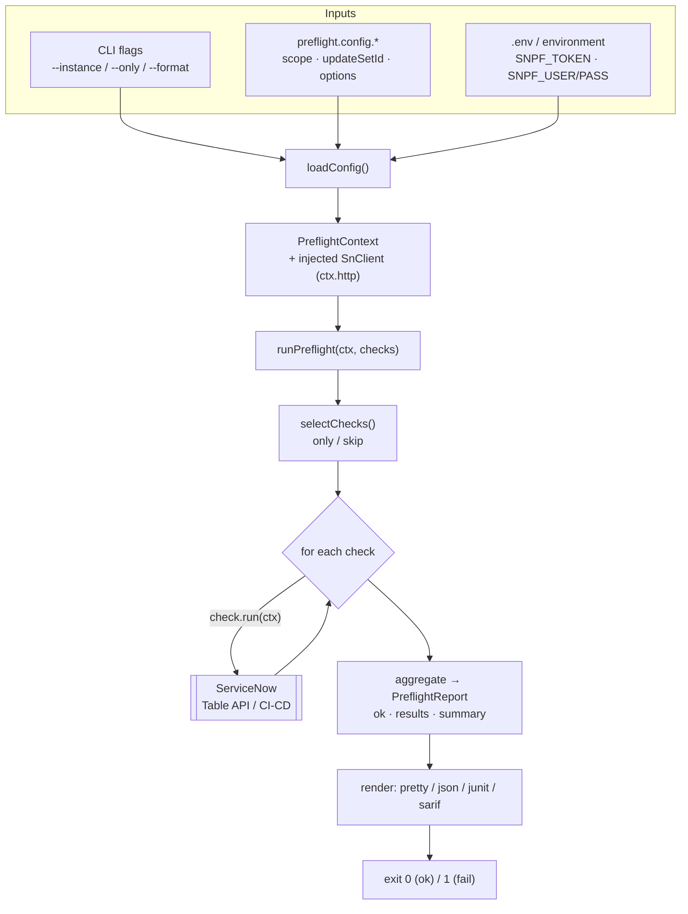
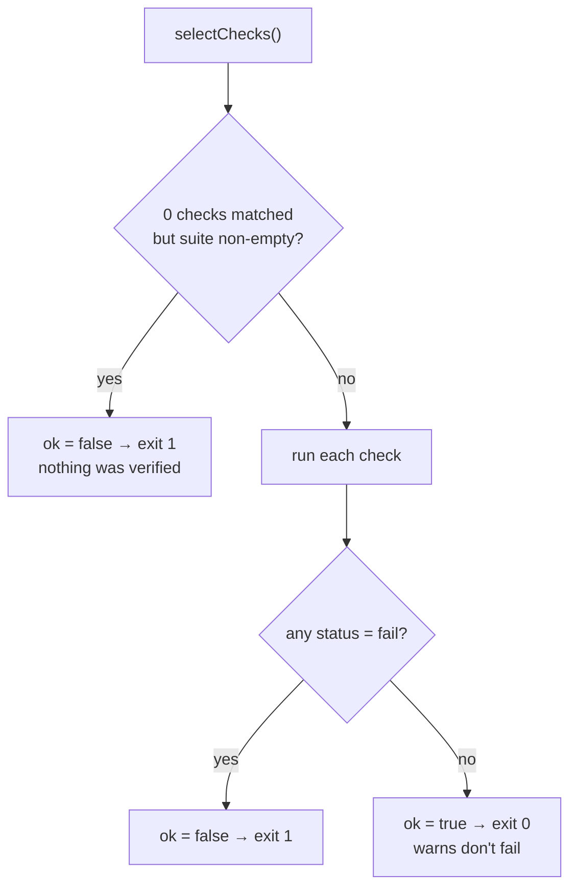
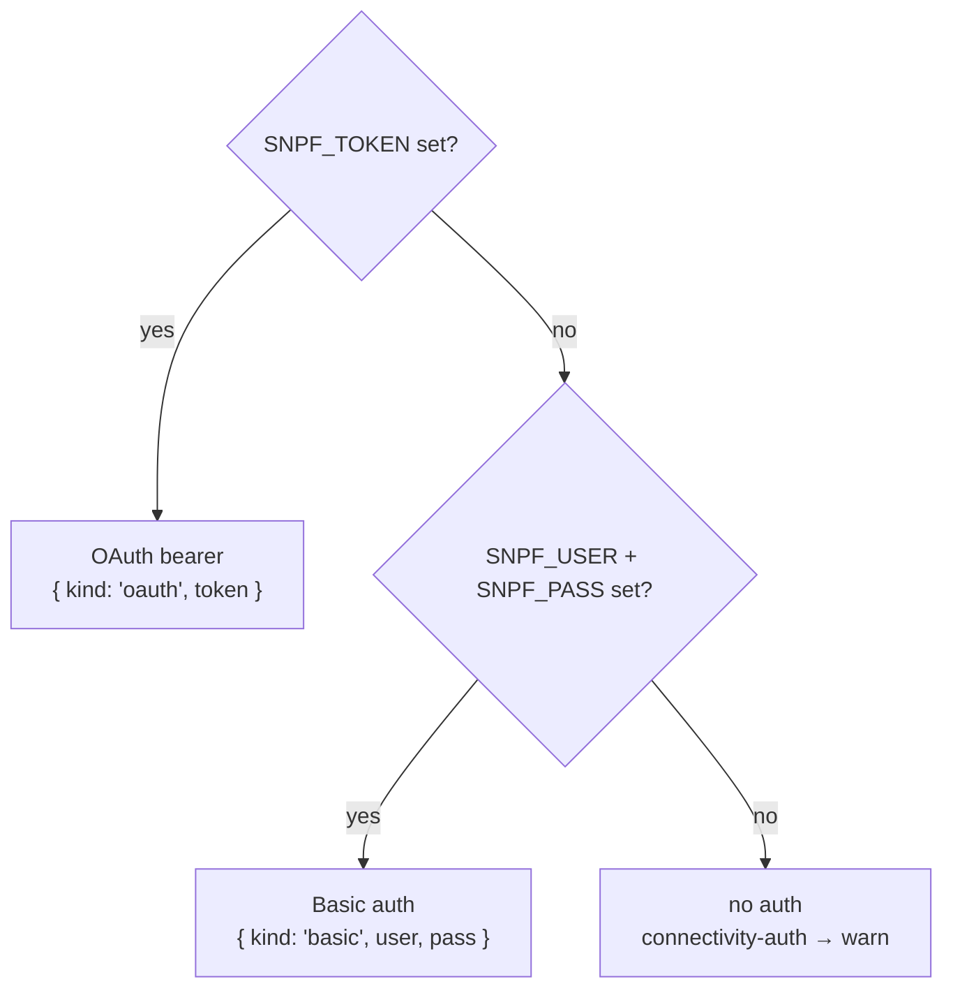
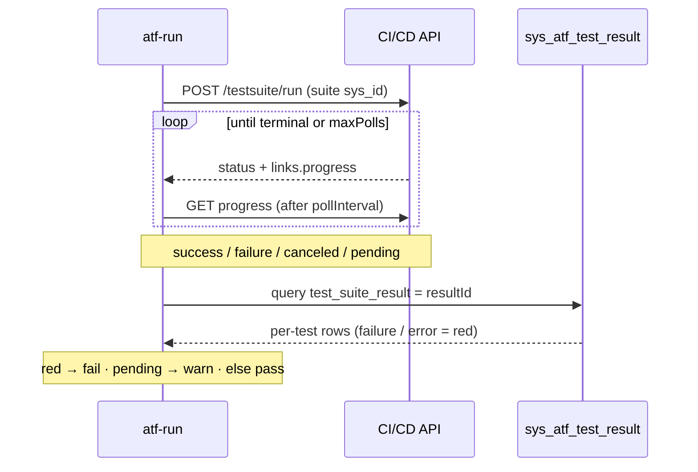
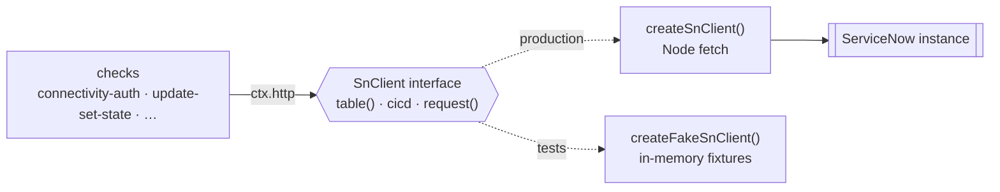

# servicenow-preflight

<!-- badges:start -->

| [](https://nodejs.org) | [](LICENSE) | [](https://github.com/IvanBBaev/servicenow-preflight/actions/workflows/ci.yml) | [](https://github.com/IvanBBaev/servicenow-preflight/commits/main) | [](https://www.typescriptlang.org) |
| :-------------------------------------------------------------------------------------------------------------------------------: | :------------------------------------------------------------------------------------: | :--------------------------------------------------------------------------------------------------------------------------------------------------------------------------------------------------------------------------------------------------------: | :-----------------------------------------------------------------------------------------------------------------------------------------------------------------------------------------------------------------------: | :-----------------------------------------------------------------------------------------------------------------------------------------------------------------------: |

<!-- badges:end -->

Pre-deployment **preflight checks** for ServiceNow — validate a target instance
and your changes _before_ you ship them. Point it at an instance, and it verifies
the things that quietly break a deployment: an update set that isn't actually
complete, failing ATF tests, a missing plugin dependency, untranslated strings,
or a wide-open ACL. It ships as both a **CLI** you can drop into a CI gate and a
small, dependency-free **library** you can embed in your own tooling.

> Independent, community-built project. Not affiliated with, endorsed by, or
> sponsored by ServiceNow, Inc.

## Contents

- [Why](#why)
- [Requirements](#requirements)
- [Install](#install)
- [Quick start](#quick-start)
- [How it works](#how-it-works)
- [CLI](#cli)
- [Credentials](#credentials)
- [Configuration file](#configuration-file)
- [Checks](#checks)
- [Report formats](#report-formats)
- [CI integration](#ci-integration)
- [Library API](#library-api)
- [Writing a custom check](#writing-a-custom-check)
- [Testing with the fake client](#testing-with-the-fake-client)
- [Development](#development)
- [Security](#security)
- [Support](#support)
- [License](#license)

## Why

Most failed ServiceNow deployments fail for boring, detectable reasons. An update
set is left "in progress", a dependent plugin was never activated on the target,
a scoped app ships an ACL with no role and no condition, or the German locale is
half-translated. `servicenow-preflight` turns those into an automated gate:

- **CI-native** — exits non-zero on any hard failure, so it slots straight into a
  pipeline before a promote/deploy step.
- **Read-mostly and safe** — checks query the instance (Table API, CI/CD ATF);
  they don't mutate configuration. The one action taken is _running_ the ATF
  suites you explicitly configure.
- **Zero runtime dependencies** — a single package built on Node's global
  `fetch`. Nothing to audit but the source.
- **Machine-readable output** — `pretty`, `json`, `junit` (test reports) and
  `sarif` (code-scanning) formats out of the box.
- **Secret-safe** — credentials are read from the environment only, never from a
  config file, and never appear in logs or error messages.

## Requirements

- **Node.js >= 20** (developed and tested on 22; `.nvmrc` pins 22).
- A reachable ServiceNow instance and credentials with read access to the tables
  the checks you enable touch (`sys_user`, `sys_update_set`, `sys_store_app`,
  `sys_security_acl`, …) plus the CI/CD ATF API if you run `atf-run`.

## Install

```bash
# Project dependency (library + CLI)
npm install servicenow-preflight

# Or run it ad-hoc without installing
npx servicenow-preflight --instance https://dev12345.service-now.com
```

The package exposes two identical binaries — `servicenow-preflight` and the short
alias `snpf`.

## Quick start

```bash
# 1. Provide credentials via the environment (or a .env file — see below).
export SNPF_INSTANCE=https://dev12345.service-now.com
export SNPF_USER=admin
export SNPF_PASS='***'

# 2. Run the default check suite.
snpf
```

```text
✓ instance-url-configured: Instance URL looks good: https://dev12345.service-now.com
✓ connectivity-auth: Instance is reachable and the credentials authenticate.
! update-set-state: No update set specified (pass --update-set or set PreflightContext.updateSetId); skipping update-set state check.
! atf-run: No ATF suite configured (set options.atfSuites or options.atfSuiteId); skipping.
! scoped-app-deps: No required apps declared (set options.requiredApps to verify dependencies); skipping.
! i18n-completeness: No target scope set (PreflightContext.scope); skipping i18n completeness check.
! acl-role-sanity: No scope set — skipping ACL/role sanity (pass a scope to enable it).

2 passed, 5 warnings, 0 failed
```

Out of the box only the two universal checks do real work; the rest turn on once
you give them what they need (a scope, an update set, ATF suite ids, required
apps). You supply those through a [config file](#configuration-file).

## How it works

`runPreflight(ctx, checks?)` runs a list of checks against the target instance,
in order, and aggregates their results into a single `PreflightReport`. The CLI
is a thin wrapper over that same function:



Each check returns exactly one of three statuses:

| Status | Icon | Meaning                                                                 | Fails the run? |
| ------ | :--: | ----------------------------------------------------------------------- | :------------: |
| `pass` | `✓`  | The condition holds.                                                    |       No       |
| `warn` | `!`  | Advisory — not configured, transiently unreachable, or a soft red flag. |       No       |
| `fail` | `✗`  | A real problem that should block the deployment.                        |    **Yes**     |

The run is **ok** when no check returns `fail`. The report also carries a
`summary` (`{ pass, warn, fail }` counts). Every check is defensively written so
it **never throws** — transport, auth and API errors are caught and mapped to a
result — so one flaky check can't crash the whole run.

The run's outcome — and the CLI exit code — follows a single rule: any `fail`
(or a selection that verified nothing) fails the run; warnings never do.



**Exit codes (CLI):**

| Code | When                                                                                                                                 |
| :--: | ------------------------------------------------------------------------------------------------------------------------------------ |
| `0`  | The run completed and no check returned `fail`.                                                                                      |
| `1`  | At least one check returned `fail`, **or** a selection matched zero checks (nothing was verified), **or** the CLI hit a fatal error. |

A selection that narrows to zero checks is treated as a **failure**, not a
vacuous pass — the tool refuses to exit `0` having verified nothing.

## CLI

```bash
snpf [options]
```

Both `--flag value` and `--flag=value` forms are accepted.

| Flag                     | Description                                                   |
| ------------------------ | ------------------------------------------------------------- |
| `-i`, `--instance <url>` | Target ServiceNow instance URL.                               |
| `--config <path>`        | Path to a config file (default: auto-discovered — see below). |
| `--only <csv>`           | Run only these checks (comma-separated check names).          |
| `--skip <csv>`           | Skip these checks (comma-separated check names).              |
| `--format <fmt>`         | Output format: `pretty` (default), `json`, `junit`, `sarif`.  |
| `--json`                 | Shorthand for `--format json`.                                |
| `-h`, `--help`           | Show help.                                                    |

Run a subset by name:

```bash
snpf --only connectivity-auth,update-set-state
snpf --skip atf-run
```

`--instance`, `--only` and `--skip` on the command line override the
corresponding values from the config file.

> The `scope` and `updateSetId` a run targets come from the config file (or the
> programmatic context), not from CLI flags.

## Credentials

Credentials are read from the **environment only** — never from the config file,
never logged, and never placed into an error message:

| Variable                  | Purpose                                                     |
| ------------------------- | ----------------------------------------------------------- |
| `SNPF_TOKEN`              | OAuth bearer token. **Takes precedence over Basic** if set. |
| `SNPF_USER` + `SNPF_PASS` | Basic-auth username and password (both required).           |
| `SNPF_INSTANCE`           | Instance URL, used when `--instance` / config is unset.     |

Auth is resolved from the environment with OAuth winning over Basic:



A `.env` file in the working directory is loaded automatically (a tiny built-in
parser: `KEY=value`, `#` comments and optional surrounding quotes). **Real
environment variables always win** over `.env` entries, so `.env` is a
convenience for local runs, not an override.

```dotenv
# .env — keep it out of version control
SNPF_INSTANCE=https://dev12345.service-now.com
SNPF_USER=admin
SNPF_PASS=your-password
```

If no credentials are configured, `connectivity-auth` reports `warn` rather than
`fail` (there is nothing to authenticate with), and checks that need the network
degrade to advisory warnings.

## Configuration file

The CLI auto-discovers the first of these in the working directory (or point at
one with `--config <path>`):

1. `preflight.config.json`
2. `preflight.config.js`
3. `preflight.config.mjs`

The JS/MJS forms may export the config as a `default` export or a named `config`
export. The file declares the target, which checks to run, and per-check
options — but **never credentials**.

```json
{
  "instanceUrl": "https://dev12345.service-now.com",
  "scope": "x_acme_app",
  "updateSetId": "a1b2c3d4e5f6a1b2c3d4e5f6a1b2c3d4",
  "select": { "skip": ["atf-run"] },
  "options": {
    "languages": ["de", "fr"],
    "baseLanguage": "en",
    "requiredApps": [{ "id": "x_acme_lib", "minVersion": "2.1.0" }],
    "atfSuites": ["<suite_sys_id>"]
  }
}
```

| Field         | Type                                   | Used by                                       |
| ------------- | -------------------------------------- | --------------------------------------------- |
| `instanceUrl` | `string`                               | Target instance (CLI `--instance` overrides). |
| `scope`       | `string`                               | `i18n-completeness`, `acl-role-sanity`.       |
| `updateSetId` | `string` (sys_id)                      | `update-set-state`.                           |
| `select`      | `{ only?: string[]; skip?: string[] }` | Check selection (CLI flags override).         |
| `options`     | `object`                               | Per-check options (see [Checks](#checks)).    |

CLI flags override the config file: `--instance`, `--only` and `--skip` win over
`instanceUrl` and `select`.

## Checks

Seven checks ship in the default suite. The first two always run; the rest
activate once you provide their inputs (otherwise they `warn` and explain what's
missing — they never silently pass).

| Name                      | Needs                        | Verifies                                                                         |
| ------------------------- | ---------------------------- | -------------------------------------------------------------------------------- |
| `instance-url-configured` | —                            | An instance URL is present and well-formed (prefers `https`).                    |
| `connectivity-auth`       | credentials                  | The instance is reachable and the credentials authenticate.                      |
| `update-set-state`        | `updateSetId`                | The target update set is complete, non-empty, and free of merge collisions.      |
| `atf-run`                 | `options.atfSuites`          | Configured ATF test suites run green (no failing or errored tests).              |
| `scoped-app-deps`         | `options.requiredApps`       | Required scoped apps / plugins are installed, active, and meet any `minVersion`. |
| `i18n-completeness`       | `scope`, `options.languages` | Every configured language has full translation coverage for the scope.           |
| `acl-role-sanity`         | `scope`                      | No wide-open mutating ACLs, and no ACLs referencing non-existent roles.          |

### `instance-url-configured`

- **fail** — no URL, or the value isn't a valid URL.
- **warn** — a valid URL that isn't `https`.
- **pass** — a well-formed `https` URL.

### `connectivity-auth`

Pings the Table API (`sys_user`, one row) with the configured credentials.

- **fail** — 401 / missing credentials (auth failed), the instance is unreachable
  (DNS / connection / timeout), or an unexpected non-2xx response.
- **warn** — no credentials configured, or 403 (reachable and authenticated, but
  the account lacks rights — degraded, not fatal).
- **pass** — reachable and authenticated.

### `update-set-state`

Reads the `sys_update_set` record named by `updateSetId` and its
`sys_update_xml` change rows.

- **fail** — the set doesn't exist, is still in progress (`building`, `loaded`,
  `previewed`, `in progress`, …), is `complete` but has **0** changes, or the
  read failed for auth/HTTP reasons.
- **warn** — no `updateSetId` set, the set is in an unrecognised state, the
  instance was transiently unreachable, or the set shows merge/collision
  indicators (deployable, but review it).
- **pass** — the set is `complete` and carries at least one change.

### `atf-run`

Runs each configured ATF suite via the CI/CD API, polls it to a terminal state,
then reads the per-test rows from `sys_atf_test_result`.



- Options: `options.atfSuites` (`string[]`) and/or `options.atfSuiteId`
  (`string`) — suite `sys_id`s. Both are merged and de-duplicated.
- **fail** — any test is red (failed assertion or script error); the message
  carries the failing assertion text (first few, then a `+N more` count).
- **warn** — no suite configured, or a run is still pending/running (re-run once
  it settles), or the instance was transiently unreachable.
- **pass** — every configured suite settled green with no red tests.

### `scoped-app-deps`

Looks each required app up in `sys_store_app` (scoped apps) and `sys_plugins`
(platform plugins), matching on the common identity fields.

- Options: `options.requiredApps` — a list of `{ id: string, minVersion?: string }`.
  Version comparison is numeric, dot-separated (best-effort semver-ish).
- **fail** — a required app is missing, installed-but-inactive, or below its
  `minVersion`.
- **warn** — none declared, some entries malformed (dropped, never silently
  passed), or an app is present but its version can't be read.
- **pass** — every declared dependency is present, active, and up to date.

### `i18n-completeness`

Counts translated rows per language in the scope across `sys_translated_text`
and `sys_ui_message`.

- Options: `options.languages` (`string[]` or comma-separated string) and an
  optional `options.baseLanguage` reference language.
- The expected string count is the `baseLanguage`'s coverage when set; otherwise
  the richest target language (so you need **at least two** languages, or an
  explicit `baseLanguage`, to infer a baseline).
- **fail** — one or more languages have translation gaps, or the instance
  returned an HTTP error.
- **warn** — no scope / no languages configured, only one language with no
  baseline, no translatable strings found, or the instance was unreachable / auth
  degraded (can't determine coverage).
- **pass** — every required language is fully covered.

### `acl-role-sanity`

Reads every `sys_security_acl` in the scope, its role links
(`sys_security_acl_role`), and the set of roles that exist on the instance.

- **fail** — a mutating ACL (`write` / `create` / `delete`) is wide open (no
  role **and** no condition **and** no script → public write), or an ACL
  references a role that doesn't exist on the instance (a dangling grant).
- **warn** — no scope set, a wide-open **read** ACL (public read), inactive
  shipped ACLs, or the ACL tables couldn't be read (missing table / insufficient
  rights / unreachable).
- **pass** — every ACL is gated and every referenced role resolves (or the scope
  ships no ACLs).

## Report formats

Selected with `--format` (or `--json`). Passing checks are omitted from the
machine-readable non-`json` formats; only `pretty` and `json` list everything.

- **`pretty`** _(default)_ — human-readable lines (`✓ / ! / ✗`) plus a summary
  line, written to stdout.
- **`json`** — the full `PreflightReport` (`ok`, `results[]`, `summary`) as
  pretty-printed JSON.
- **`junit`** — a JUnit XML document, one `<testcase>` per check. A `fail`
  becomes a `<failure>`; a `warn` is a passing case with a `<system-out>` note.
  Suitable for CI test-report ingestion. Control characters that are illegal in
  XML 1.0 are stripped and the five XML entities are escaped, so arbitrary ATF
  output folded into a message can't break the document.
- **`sarif`** — a SARIF 2.1.0 log (one result per non-pass check; `fail` →
  `error`, `warn` → `warning`) for code-scanning dashboards / GitHub Advanced
  Security.

```bash
snpf --format junit > preflight-junit.xml
snpf --format sarif > preflight.sarif
snpf --json | jq '.summary'
```

## CI integration

`servicenow-preflight` exits non-zero on failure, so a single step gates a
pipeline. Example GitHub Actions job that runs the checks and uploads the SARIF
log to code scanning:

```yaml
name: ServiceNow preflight
on:
  workflow_dispatch:
  pull_request:

jobs:
  preflight:
    runs-on: ubuntu-latest
    permissions:
      security-events: write # to upload SARIF
    steps:
      - uses: actions/checkout@v4
      - uses: actions/setup-node@v4
        with:
          node-version: 22
      - name: Run preflight
        env:
          SNPF_INSTANCE: ${{ secrets.SNPF_INSTANCE }}
          SNPF_USER: ${{ secrets.SNPF_USER }}
          SNPF_PASS: ${{ secrets.SNPF_PASS }}
        run: npx servicenow-preflight --format sarif > preflight.sarif
      - name: Upload SARIF
        if: always()
        uses: github/codeql-action/upload-sarif@v3
        with:
          sarif_file: preflight.sarif
```

Store credentials as CI secrets — the tool only ever reads them from the
environment.

## Library API

The public surface is [src/index.ts](src/index.ts). Everything below is exported
from the package root.

```ts
import { runPreflight, createSnClient } from "servicenow-preflight";

const http = createSnClient({
  instanceUrl: "https://dev12345.service-now.com",
  auth: {
    kind: "basic",
    user: process.env.SNPF_USER!,
    pass: process.env.SNPF_PASS!,
  },
});

const report = await runPreflight({
  instanceUrl: "https://dev12345.service-now.com",
  http,
  scope: "x_acme_app",
  updateSetId: "a1b2c3d4e5f6a1b2c3d4e5f6a1b2c3d4",
  options: { languages: ["de", "fr"], baseLanguage: "en" },
});

console.log(report.ok, report.summary); // e.g. false { pass: 2, warn: 4, fail: 1 }
```

### Core

- **`runPreflight(ctx, checks?)`** → `Promise<PreflightReport>` — run the checks
  (defaults to `defaultChecks`) and aggregate the report. `ctx.select` (only /
  skip by name) filters `checks` before they run.
- **`selectChecks(checks, select?)`** → `Check[]` — the same only/skip filter,
  exposed for reuse. Unknown names are ignored.
- **`defaultChecks`** and each individual check (`instanceUrlConfigured`,
  `connectivityAuth`, `updateSetState`, `atfRun`, `scopedAppDeps`,
  `i18nCompleteness`, `aclRoleSanity`) are exported so you can compose your own
  list.

The **context** (`PreflightContext`) requires an injected HTTP client
(`ctx.http`). Checks _always_ call `ctx.http`, never `fetch` directly — that's
what keeps them unit-testable. Use `createSnClient` for a real instance, or
`createFakeSnClient` in tests.



### HTTP client

- **`createSnClient(config)`** → `SnClient`. Config: `{ instanceUrl, auth,
timeoutMs?, cicdPollIntervalMs?, cicdMaxPolls? }` (defaults: 30 s timeout,
  2 s poll interval, 60 max polls). Backed by Node's global `fetch`; zero
  dependencies.
- The `SnClient` surface: `table(name)` (`.get(sysId, params?)` /
  `.query(params?)`), `cicd.runTestSuite(suiteSysId)`, and a low-level
  `request(method, path, opts?)` escape hatch.
- `table().query()` **auto-paginates** unless you pass a `sysparm_limit`, so
  large tables are never silently truncated at ServiceNow's default window (a
  safety cap bounds pathological cases).

### Errors

`createSnClient`'s helpers throw a small typed hierarchy (all extend `SnError`),
which checks catch and map to results:

| Error            | Raised when                                                |
| ---------------- | ---------------------------------------------------------- |
| `SnAuthError`    | HTTP 401 / 403, or missing credentials (`.status`).        |
| `SnNetworkError` | DNS / connection failure / timeout — instance unreachable. |
| `SnHttpError`    | Any other non-2xx status (`.status`, `.body`).             |

Secrets never appear in these messages.

### Report formatters

- **`formatJUnit(report)`** → JUnit XML string.
- **`formatSarif(report)`** → SARIF 2.1.0 JSON string.

```ts
import { runPreflight, formatSarif } from "servicenow-preflight";

const report = await runPreflight({
  http,
  select: { only: ["connectivity-auth"] },
});
const sarif = formatSarif(report);
```

### Config helpers

- **`loadConfig(cwd?, opts?)`** → `{ config, auth?, configPath? }` — the same
  discovery the CLI uses (config file + `.env` + env credentials).
- **`resolveAuthFromEnv(env?)`** → `PreflightAuth | undefined`.

## Writing a custom check

Implement the `Check` interface and pass a custom list to `runPreflight`:

```ts
import { runPreflight, type Check } from "servicenow-preflight";

const myCheck: Check = {
  name: "my-check",
  description: "Describe what this verifies.",
  async run(ctx) {
    const rows = await ctx.http.table("sys_user").query({ sysparm_limit: "1" });
    return {
      name: "my-check",
      status: rows.length > 0 ? "pass" : "warn",
      message: `saw ${rows.length} row(s)`,
    };
  },
};

await runPreflight({ instanceUrl: "https://…", http }, [myCheck]);
```

A well-behaved check **never throws** — catch every error surface from
`ctx.http` and map it to a `CheckResult`, following the built-in checks as a
model. To add a check to the shipped suite instead, see
[src/checks/](src/checks/) and register it in `defaultChecks`.

## Testing with the fake client

`createFakeSnClient` is an in-memory `SnClient` — seed table rows and CI/CD
responses, then assert on what a check does. No network, no secrets,
deterministic.

```js
import { createFakeSnClient } from "servicenow-preflight";
import { updateSetState } from "servicenow-preflight";

const http = createFakeSnClient({
  tables: {
    sys_update_set: [{ sys_id: "abc", name: "My set", state: "complete" }],
    sys_update_xml: [{ sys_id: "x1", update_set: "abc" }],
  },
});

const result = await updateSetState.run({
  http,
  updateSetId: "abc",
});
// result.status === "pass"
```

Force error surfaces with the `fail` fixture — globally or scoped to one table /
CI/CD op:

```js
const http = createFakeSnClient({
  tables: { sys_update_set: [] },
  fail: { auth: true }, // every call throws SnAuthError
  // or per-op: fail: { table: { sys_update_set: { network: true } } }
});
```

## Development

```bash
npm install
npm run build        # tsc -> build/
npm test             # node --test (run AFTER build — tests import from build/)
npm run lint         # eslint (type-checked flat config)
npm run format       # prettier --write
npm run format:check # prettier --check
npm run verify       # build + lint + format:check + test
npm run check        # verify + coverage (the full local gate)
```

Source lives in [src/](src/); the public API surface is
[src/index.ts](src/index.ts) and checks live under [src/checks/](src/checks/).
Tests (`test/**/*.test.js`) import the compiled output from `build/`, **so build
before testing**.

The project is ESM (`"type": "module"`) with TypeScript `Node16` resolution —
relative imports carry the `.js` extension. Prettier config: `semi`, double
quotes, `trailingComma: all`.

## Security

- Credentials are read from the **environment only** — never from the config
  file, never logged, never included in error messages.
- Checks are **read-mostly**: they query the Table API and read ATF results. The
  only write is _running_ the ATF suites you explicitly configure via
  `options.atfSuites`.
- Zero runtime dependencies — the entire supply chain is this package plus Node.

## Support

This project is built and maintained in my own time. If it saves you or your
team time, please consider supporting its continued development — sponsorship
directly funds new features, fixes and maintenance.

- **[GitHub Sponsors](https://github.com/sponsors/IvanBBaev)** — one-off or
  recurring, with no platform fee taken out (the preferred option).
- **[Ko-fi](https://ko-fi.com/ivanbbaev)** — quick one-off support; it also
  accepts **PayPal**, so it's the fallback for anyone without a GitHub account.
- **[Donate (Donatree)](https://donatr.ee/ivanbbaev/)** — a no-account donation
  page (card, PayPal and more) for a one-off tip.

[](https://github.com/sponsors/IvanBBaev)
[](https://ko-fi.com/ivanbbaev)
[](https://donatr.ee/ivanbbaev/)

## License

[MIT](LICENSE) © Ivan Baev
